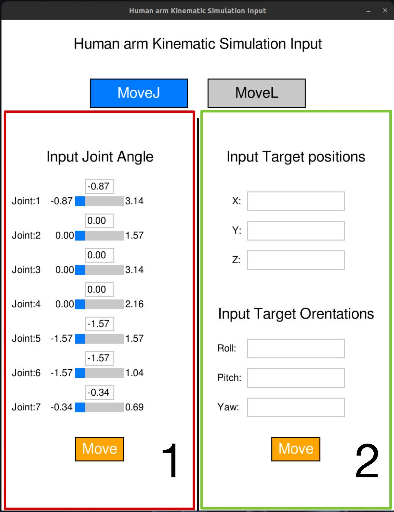
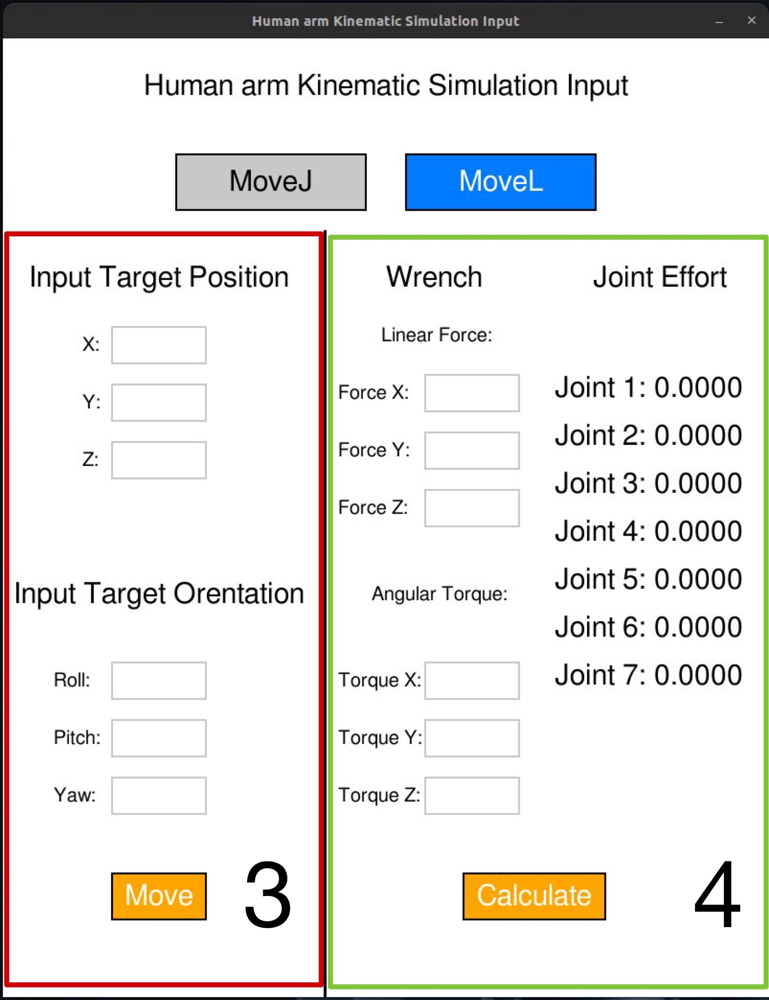

# 7 DOF MANIPULATOR SIMULATES THE JOINT PATTERN OF A HUMAN ARM KINEMATICS SIMULATION

This project simulate the human arm movement from the shoulder to wrist  that was 3D visualized by RVIZ in ROS2.


# Table of Contents
- [7 DOF MANIPULATOR SIMULATES THE JOINT PATTERN OF A HUMAN ARM KINEMATICS SIMULATION](#7-dof-manipulator-simulates-the-joint-pattern-of-a-human-arm-kinematics-simulation)
- [Table of Contents](#table-of-contents)
- [User installation guide](#user-installation-guide)
  - [Prerequisites](#prerequisites)
  - [Install project workspace](#install-project-workspace)
- [Methodology](#methodology)
  - [MDH - Parameter](#mdh---parameter)
  - [Psudoinverse jacobian](#psudoinverse-jacobian)
  - [Joint effort](#joint-effort)
- [System architecture](#system-architecture)
- [User guide](#user-guide)
  - [How to use simulation](#how-to-use-simulation)
  - [How to use input UI](#how-to-use-input-ui)
  - [How to call simulation by service](#how-to-call-simulation-by-service)
- [Demos and Result](#demos-and-result)
- [Conclusion](#conclusion)
- [Future planr](#future-planr)
- [Developer Member](#developer-member)
  
# User installation guide 

## Prerequisites

Ensure you have the following dependencies installed

**Middle ware**
- `ROS2 Humble`

**Python Library**
- `roboticstoolbox`
- `spatialmath`
- `numpy`
- `scipy`
- `pygame`


## Install project workspace
Clone this workspace

```bash
git clone https://github.com/PoFamily/human_arm_ws.git
```

# Methodology

## MDH - Parameter

It was a paratemter the describe positioning of Joint and the table below is our MDH-Parameter of the human arm model.

| Joint | $\alpha_{i-1}$ |  $a_{i-1}$  |  $\theta_i$  | $d_i$ |
| ----- | - | - | - | - |
|   1   | 0.0 | $\pi/2$  | 0.0 | $q_1$         |
|   2   | 0.0 | $\pi/2$  | 0.0 | $q_2 + \pi/2$ |
|   3   | 0.0 | $-\pi/2$ | 0.0 | $q_3 - \pi/2$ |
|   4   | 0.4 | $-\pi/2$ | 0.0 | $q_4 - \pi/2$ |
|   5   | 0.0 | $-\pi/2$ | 0.4 | $q_5$         |
|   6   | 0.0 | $\pi/2$  | 0.0 | $q_6 + \pi/2$ |
|   7   | 0.0 | $\pi/2$  | 0.0 | $q_7$         |

## Psudoinverse jacobian

Use to find movement velocity of each joint by using Pseudoinverse method of Jacobian matrix by this equation

```math
\dot{q} = J^{\dagger}(q)\dot{x}
```
"Define"
- $\dot{q}$ represent velocity in each joint

- $\dot{x}$ represent velocity of end-effector 
- $J^{\dagger}(q)$ represent Pseudoinverse method of Jacobian matrix of each joint that was at angle q

By $J^{\dagger}(q)$  or Pesudoinverse method of jacobian matrix from

```math
J^{\dagger} = J^T(JJ^T)^{-1}
```

Define
- $J$ represent Jacobian matrix at each joint at any angle of q

## Joint effort

Find Joint Effort from equation of Static Force by this equation

```math
\tau = J^T(q)w
```

Define
- $\tau$ represent Joint Efort Value
- $w$ represent Wrench value that effect to the end-effector

# System architecture 


ระบบมีการแบ่งการทำงานออกเป็น Node ย่อยที่ทำหน้าที่แตกต่างกันจำนวน 4 node ประกอบด้วย 

- Input_node เป็น node สำหรับการแสดงผล UI สำหรับการ Input ค่าต่าง ๆ สำหรับการควบคุมการเคลื่อนที่ของ Model และแสดงผลค่า Joint Effort จากการคำนวณ 

- Controller_node เป็น node สำหรับสั่งงานการควบคุมการทำในรูปแบบต่าง ๆ โดยรับ Input จาก Input_node และสั่งงานต่อไปยัง Jointstate_node 

- Jointstate_node เป็น node สำหรับสั่งงานค่าในการขยับของแต่ละข้อต่อตามคำสั่งที่ได้มาจาก Controller_node 

- Joint_state_publisher เป็น node สำหรับควบคุมการเคลื่อนที่ของ Model ที่แสดงผลบน RVIZ

# User guide

หลังจาก clone workspace มาแล้วให้ทำการ buil and source

```
cd human_arm_ws/
colcon build
source install/setup.bash
```

## How to use simulation
เรียกใช้งาน ระบบ simulation ผ่าน ros

**เรียกใช้งานระบบ controller**
```
ros2 launch human_arm_simulation human_arm_controller.launch.py
```

**เรียกใช้งาน Input UI**
```
ros2 run human_arm_simulation input_node.py
```

## How to use input UI

**MoveJ**


สามารถใส่ข้อมูลได้ 2 รูปแบบ
1. กำหนดค่า configulation space ของแต่ละ joint โดยการใช้ slide bar หรือ กรอกค่าในช่อง(ตามรูปในส่วนที่ 1)
2. กำหนดค่า task space ของ target โดยการกรอกค่าลงในแต่ละช่อง (ตามรูปในส่วนที่ 2)

**MoveL**


สามารถใส่ข้อมูลได้ 2 รูปแบบ
1. กำหนดค่า task space ของ target โดยการกรอกค่าลงในแต่ละช่อง (ตามรูปในส่วนที่ 3)
2. กำหนดค่า input wrench ในแต่ละแนวแรงที่กระทำต่อปลายแขน โดยการกรอกค่าลงในแต่ละช่อง และสามารถดูผลการคำนวณ joint effort ได้ที่ด้านข้าง (ตามรูปในส่วนที่ 4)
3. 
**ขั้นตอนการใช้งาน**
1. เลือก Move mode ด้านบน ว่าจะใช้ MoveJ หรือ MoveL 
2. ระบุค่าเพื่อกำหนดการเคลื่อนที่
3. กด Move หรือ calculate

## How to call simulation by service

สามารถใช้การ call service รูปแบบต่าง ๆ ของ ROS ในการ call ได้ โดยโครงสร้างของแต่ละ service เป็นดังนี้


# Demos and Result

<video controls src="picture/DemoVDO.mp4" title="DemoVDO"></video>

# Conclusion

# Future planr
- ควบคุม joint limit ในการ move to target
- ทดสอบการเคลื่อนที่เทียบกับแขนคน
- เพิ่มควบคุมส่วนของมือ
   
# Developer Member

- Waritthon Kongnoo
- Chayanat Lertwittayanuruk
- Chawaphon Wachiraniramit
- Kraiwich Vichakhot